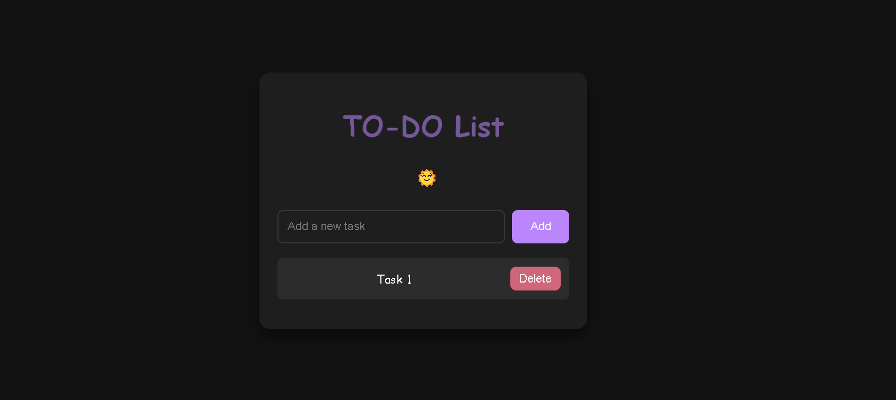

# Basic To-Do List Application

This is a simple To-Do List application that allows users to add, delete, and mark tasks as complete. It's a basic project made using HTML, CSS, and JavaScript, suitable for beginners.

## Features

- Add new tasks to the list
- Mark tasks as completed
- Remove tasks from the list
- Interactive and responsive user interface

## Demo

You can try the live demo [here](https://todo-list-beige-gamma-23.vercel.app/).

## Screenshots




## Getting Started

Follow the instructions below to get a copy of the project up and running on your local machine for development and testing purposes.

### Prerequisites

You need a modern web browser (Chrome, Firefox, Safari, etc.) to run this project.

### Installation

1. **Clone the repository:**

```
   git clone https://github.com/sarbajitacharjee/TODO_LIST.git
```
   
Navigate to the project directory:

```bash
cd todo-list-app
```
Open index.html in your browser:
You can simply open the index.html file with your browser to view the app.

# Usage

Add a task: Type the task into the input field and click the "Add" button or press Enter.
Mark task as completed: Click on the task name to mark it as completed (it will be crossed out).
Delete a task: Click on the delete button next to the task to remove it from the list.

